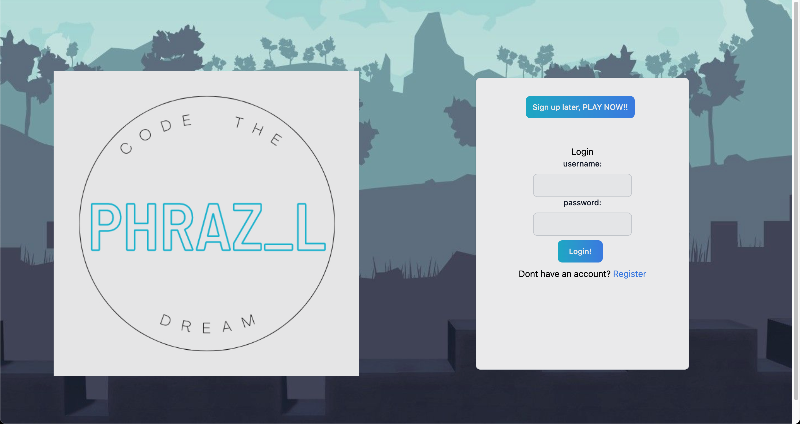
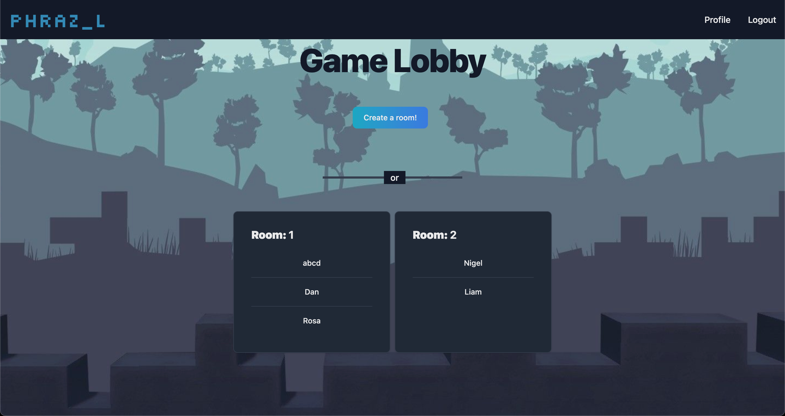
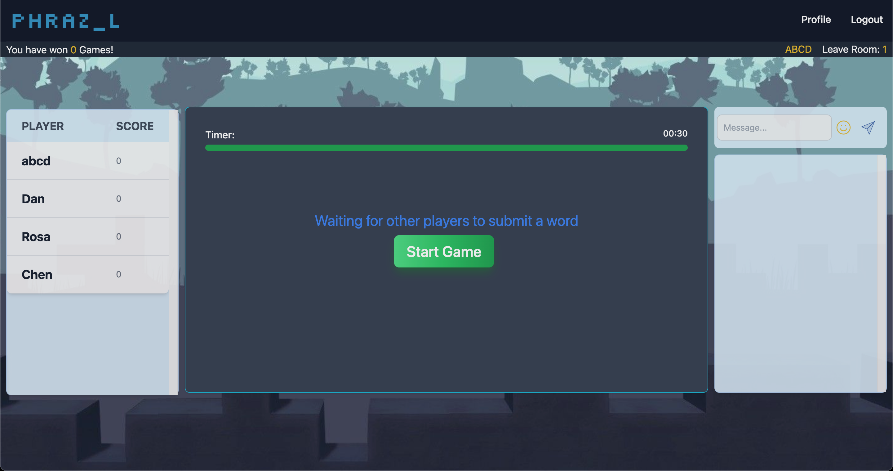
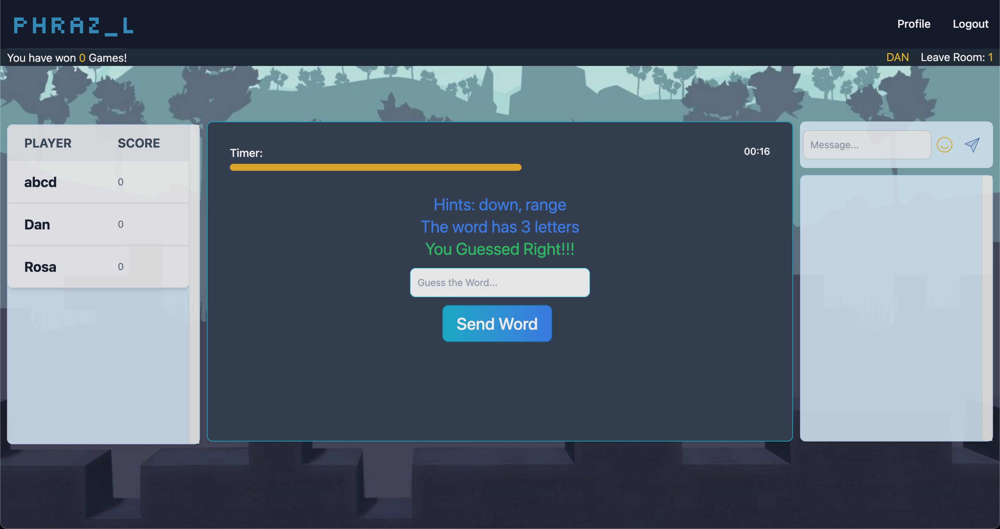
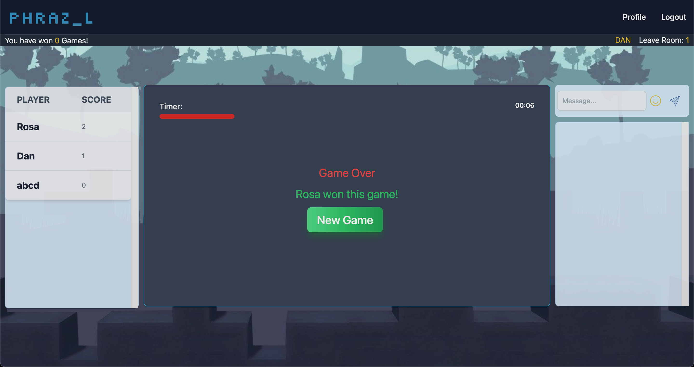

# Back-End Repo for "Phrazel"

Phrazel is a game created by Team Concurrent of [Code the Dream's](https://github.com/Code-the-Dream-School) Baboon/Bald Eagle Practicum. Team Concurrent is made up of our back-end team ([Aboubacar](https://github.com/aboubacar108), [Alejandro](https://github.com/Alejandro-Patino-Camargo), & [Mauricio](https://github.com/mautoranzo)) & our front-end team ([MacKenzie](https://github.com/mjs94080), [Cesar](https://github.com/wowgr8), & [Brendan](https://github.com/bhoconnor)). We were mentored by [Dan](https://github.com/benochi) & [Frank](https://github.com/frankstepanski) of Code the Dream (CTD).

Phrazel is being deployed on Vercel on the front-end & Render on the back-end--stay tuned for the fully-deployed links.

### Game screenshots

**Landing page image**:

 

**Game lobby image**:

 

**Game screen images**:
 
_Waiting for players to submit words_
 

 

_API-sourced hints & a correct guess_
 

 

_Winner & Game Over screen_
 

 

### Local development

Trying to run the game locally? You will need to run both this back-end app & [the front-end server here](https://github.com/wowgr8/phrazel-front) on your local machine.

Note that you can also see the history of the project for the time being on the CTD repos that the front & back-ends were forked off of--see the [old front-end repo here](https://github.com/Code-the-Dream-School/bb-practicum-team-2-front) & the [old back-end repo here](https://github.com/Code-the-Dream-School/bb-practicum-team-2-back).

### Steps for local development

1. Clone this repository
2. Run `npm install` to install dependencies
3. Run `npm start` to start the development server
